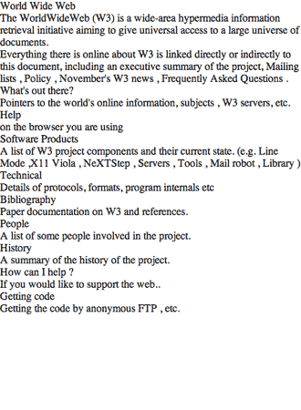

# Using a CSS Reset
A **CSS Reset** (or “Reset CSS”) is a short, often compressed (minified) set of CSS rules that resets the styling of all HTML elements to a consistent baseline. In case you didn't know, every browser has its own default 'user agent' stylesheet, that it uses to make unstyled websites appear more legible.

## CSS Reset in Action
To illustrate how CSS resets affect the way a page looks, let's look at the first website created, [TheProject.html](https://www.w3.org/History/19921103-hypertext/hypertext/WWW/TheProject.html).

Without CSS Reset | With a CSS Reset
----------------- | ----------------
 | 


## Why Use a CSS Reset?
You might wonder what this is all for – well, it’s simple. From the consistent base that you’ve set up via your reset, you can then go on to re-style your document, safe in the knowledge that the browsers’ differences in their default rendering of HTML can’t touch you!

[CSS Challenges #1](../../curriculum/03-sprint-homework/challenges/css-1.html)

## Using a CSS Reset
The first step is to add the CSS Reset to your styles folder, as a `reset.css` file. Then, in the head of your HTML page, link to the reset stylesheet *before* your other styles. 

```html
<head>
  <meta charset="utf-8">

  <title>Site Name</title>
  <meta name="description" content="Page Name">
  <meta name="author" content="Your Name">

  <link href="/styles/reset.css" rel="stylesheet" />
  <link href="/styles/styles.css" rel="stylesheet" />

  <style>
    /* Page Specific Styles */
    h1 {
      color: red;
    }
  </style>
</head>

```
