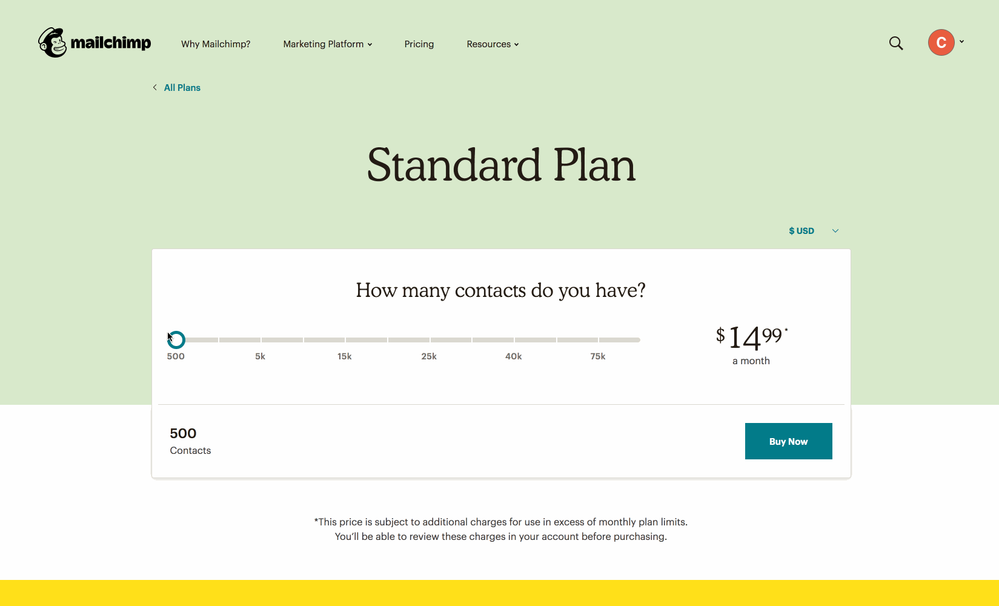

# Using JavaScript with HTML

JavaScript is a programming language that is used to change a website after the site has **rendered**. JavaScript is most often used to *respond to user actions*. This is called making a site **interactive**. Besides responding user action, JavaScript can also create and modify the DOM (HTML elements).

Let's review the three primary programming languages that are used to build websites:

 - HTML: the **content** of the page
 - CSS: **styles** the content
 - JavaScript: **interaction** and **changing** the page
 
## JavaScript Examples

Using JavaScript to show different prices based on slider value.

https://mailchimp.com/pricing/calculator/standard/



### ❓ Question ❓

Can someone find another example of JavaScript on a site they regulary use?

## Add JavaScript to an HTML page

Remember how there are multiple ways to add CSS to an HTML page? (hint: using the `<style>` tag or linking an `.css` file) Adding JavaScript is done in a similiar way, but with a few key differences.

### 1. The `<script>` tag

The `<script>` tag is a special HTML tag which is used to write JavaScript inside of an HTML file.

Here's an example:

```html
<script">

// JavaScript code goes here
console.log("Hello from JavaScript");
 
</script>
```

> Live Demo 

#### ❓ Where does the `<script>` tag go? ❓

What are the options? 

The `<script>` tag can be placed anywhere in either the `<head>` or the `<body>` of the HTML document. However, there is a difference between them!

What happens happen if the `<script>` tag is placed in the `<head>` of the document? Consider a really long JavaScript file (5 million lines of code).

✅ `<script>` tags should be located at the end of the `<body>`

### 2. External script

Alternatively we can link to a JavaScript file using the `src` attribute on the script tag. JavaScript file always end with the `.js` file extension.

Example: 

```html

<script src="./my-first-javascript.js"></script>

```

##  💃 Exercise! 🕺 

In your web project do the following:

1. Create a new JavaScript file called: `main.js`
1. Add the following code to `main.js`: `alert("Hello world!");`
1. Add a `<script>` tag to your `index.html` page with the **src** attribute set to the new JavaScript file path

Example:

`index.html`

```html
<!DOCTYPE html>
<html>

<head>
    <title>My HTML page</title>
    <meta charset="UTF-8" />
</head>

<body>
    <h1>This is my page</h1>
 
    <script src="./main.js"></script>
</body>

</html>
```

`main.js`

```js
alert("Hello world!");
```

## JavaScript Features

### 1. Variables

Variables allow you to store a value for later. We can store all sort of things: text, numbers, even DOM nodes!

💃 **Exercise!** 🕺

1. Update your `main.js` file to include a variable.
1. Use the `alert()` function to show the value of this variable
1. Change the variable to your name!
1. Try adding multiple `alert()` call and updating the variable inbetween **calls** 

---

Answer:

```js

var name = "Carson";
alert("Hello " + name);

name = "Kevin";
alert("Hello " + name);

```

> Live Demo

### 2. Functions

Functions allow you to wrap code that can be run later. This is a similar idea to variables execpt we are storing code to be run later, as opposed to simple values.

There are two basic phases of functions

1. **Defining** the function
1. **Calling** the function

```js
// define
function showAlert() {
  alert("Hello from function!");
}

// call
showAlert();
```

> Live Demo

### 3. The `document`

The `document` is a special variable that is always available inside of the browser. It stores the entire HTML document in JavaScript and has special functions that we use to interact with the HTML document.

Lets say we wanted to add a button that increased a counter every time it is clicked. We could use the `document` **variable** to listen for button clicks and then update the counter text when ever the button is clicked.

```js
var count = 0;
var button = document.querySelector("button");
var outputDiv = document.querySelector("div.output");

button.addEventListener("click", function(event) {
    count = count + 1;
    outputDiv.innerHTML = count;
}
```
