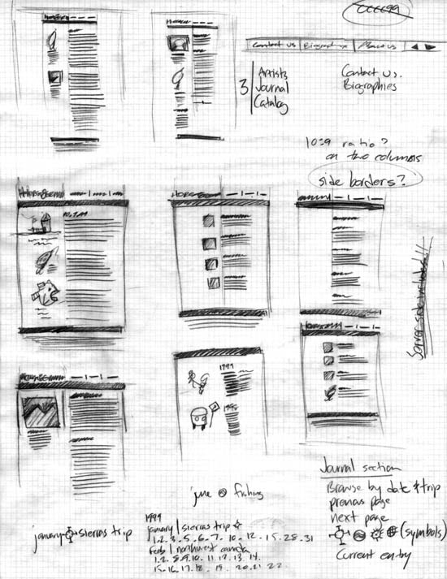

# Using Sketches to Design Websites
When you start designing a website, the first thing you may do is to start writing code - even before you have a idea of what you are building! This is a bad habit that may be hard to break. It's important to have a clear idea of what you are trying to accomplish before you start development. 

## Web development starts offline
Before we can deploy sites to the web, we start by developing and testing on our local machines, and before we can start writing code locally, we need to develop a plan of what the site will look like. A sketch is a rough design for the website and tells us what elements we need to build. 

By sketching, you can do rapid development to get your ideas down quickly. It works on-the-fly, so you can spend less time at your computer building out HTML and more time generating ideas.

## Start with what you know
Starting out with a clean slate can be tough. It's not easy to come up with a 100% complete design out of nothing. A good place to start is listing out the elements of the page that you know you will need. In most cases, a website will have a title, heading, some navigation, a footer, and a place for our main content. 

## Exercise
Sketch out a few designs for your website project. The goal is to have a design that you can start working towards when you are writing the HTML strucutre and then styling it with CSS.

Remember that this is a *draft* of the *goal* for the final website. Like all drafts, you can continue to iterate over what you have until you are happy with it. Also, don't worry if you are unsure about how to actually style everything you are imagining. You will have lots of tools and oppertunities to learn how to implement your design.